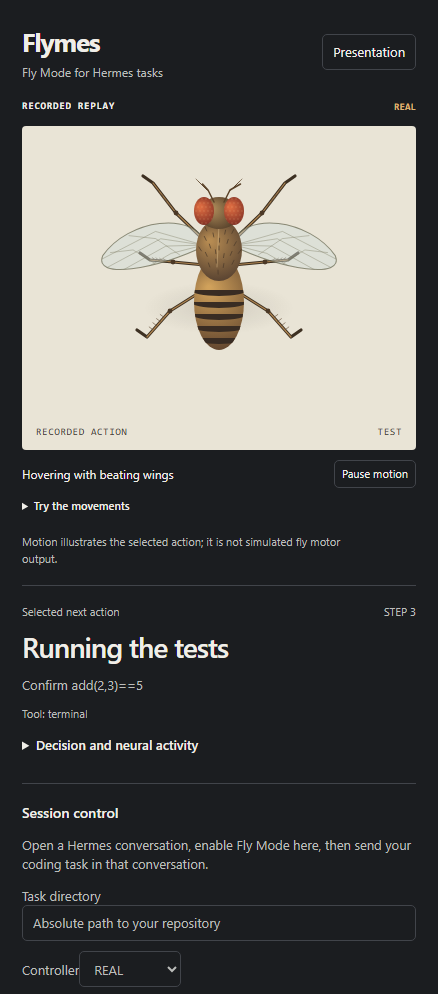

<div align="center">

<a href="https://github.com/NousResearch/hermes-agent">
  
</a>

# Flymes

**Let a fruit fly connectome choose the next tool call.**

Hermes proposes the actions. A simulation built from real fruit fly connectivity
selects one. Watch the decision, pause before execution, and compare what changes
when you alter the circuit.

<sub>POWERED BY <a href="https://github.com/NousResearch/hermes-agent">HERMES AGENT</a> &nbsp;·&nbsp; COMMUNITY EXPERIMENT &nbsp;·&nbsp; VERSION 0.2.0</sub>

<br /><br />

[See what it does](#a-circuit-in-the-conversation) &nbsp;·&nbsp; [Install](#install) &nbsp;·&nbsp; [Measured results](#what-the-experiment-shows) &nbsp;·&nbsp; [How it works](docs/modeling.md)

</div>

<p align="center">
  
</p>

The screenshot shows a recorded replay. The fly's movement illustrates the
selected software action; it is not simulated biological motor output.

## Powered by Hermes

Flymes opens as a native Hermes Desktop pane beside your conversation. It uses
Hermes's plugin hooks to select among proposed tool calls, then Hermes executes
the selected call through its normal tools and permission pipeline. Your
configured Hermes model handles language and proposes the alternatives.

This is an experimental controller for studying decisions. It does not model a
fly understanding code, and no performance advantage has been demonstrated.

## A circuit in the conversation

| | |
| --- | --- |
| **Watch a choice**<br />See the proposed actions, selected tool, neural readouts, and actual result in one pane. | **Pause before execution**<br />Hold a selected call, inspect its arguments, then resume when ready. |
| **Change the circuit**<br />Compare real, shuffled, silenced, and lesioned controllers against the same proposals and saved state. | **Keep the evidence**<br />Save decisions, neural checkpoints, and tool results. Export numeric replays for inspection. |

The full retained MaleCNS graph contains 166,700 neurons and 25,582,938 directed
weighted connections. The panel draws a bounded sample; the simulator uses the
prepared graph. Input mappings, rate dynamics, action labels, and readout pools
are engineered. [Read the data provenance](docs/data.md).

## One conversation, one selected action

1. Open a Hermes conversation and send a first message so it has a stored session.
2. In Flymes, choose **Hermes task**, enter your repository directory, and select **Enable Fly Mode**.
3. Wait for ACTIVE, then send your coding task in that conversation.
4. Hermes proposes two to six alternatives. Flymes selects one exact tool call and its arguments.
5. Watch the result, compare a decision while paused, or choose **Return control to Hermes**.

Fly Mode follows that stored session. Only one session can use the controller at
a time. Its default budget is 100 selections or 30 minutes. **Pause selection**
blocks new calls but does not cancel a tool already running. The repository
directory guides Hermes; it is not a filesystem sandbox.

See [native mode](docs/native-mode.md) for interventions, session compression,
offline recovery, and the limits of the tool gate.

## Install

The supported setup is **Windows with a local Hermes Desktop and gateway**
that support combined plugin packages, plugin tool hooks, and the Desktop SDK.
You need Python 3.11 through 3.13, uv, Git, and a configured Hermes model. The
companion runs on your machine at `127.0.0.1:8742`. Data preparation downloads
about **1.11 GB**, plus derived files and temporary processing space.

From a source checkout, run PowerShell in the Flymes directory:

```powershell
$env:HERMES_HOME = Join-Path $env:LOCALAPPDATA 'hermes'
$env:FLYMES_HERMES_ROOT = Join-Path $env:HERMES_HOME 'hermes-agent'
$env:FLYMES_HERMES_PYTHON = Join-Path $env:FLYMES_HERMES_ROOT '.venv\Scripts\python.exe'
.\scripts\setup.ps1
.\scripts\prepare-data.ps1
.\scripts\launch.ps1
.\scripts\doctor.ps1
```

Use your actual Hermes home and interpreter if they differ. Setup installs the
locked companion dependencies and enables the Flymes backend. Restart the gateway,
then enable **Flymes** in **Capabilities > Plugins**. If the pane is missing,
run **Reload desktop plugins** in the command palette.

The repository includes a prepared `catalog/` package. It has not been submitted
to the catalog. Once this package is published to GitHub, direct installation
will use `hermes plugins install Adolanium/Flymes/catalog`; run the same setup
steps from `$HERMES_HOME\plugins\flymes` afterward. The companion and dataset
still need explicit setup. No Node.js build is needed to use the Desktop panel.

[Full setup, migration, and removal instructions](docs/setup.md).

## What the experiment shows

The recorded six-step fixture comparison ended with **REAL at 3/5 checks** and
**HEURISTIC at 5/5**. The unsuccessful controller run is preserved alongside the
successful baseline. There is no training or calibration, and differences between
neural readouts do not establish better task performance.

A separate native integration smoke test selected TEST, IMPLEMENT, and TEST while
Hermes corrected subtraction to addition in a disposable Python project. That
confirms the tool-selection path for one small task. It is not a general benchmark.

Read the [measured results](docs/results.md) and
[native integration evidence](docs/native-validation.md). **Built-in demo** in
the pane runs the older bounded fixture experiment, separately from your chat.

## Your data and model usage

The simulation runs locally. Normal Hermes conversations and built-in demo
completions use your configured provider and incur its usual model usage. The
Desktop pane reaches the companion through Hermes's authenticated gateway proxy.
The companion's local bearer token is not sent to the renderer.

Downloads and new experiment records default to `$HERMES_HOME\flymes`, outside
the installed plugin. Raw records can contain tool arguments, outputs, and project
paths. Keep those records and `service.json` private. Numeric replay exports omit
worker prose and workspace paths; review anything you intend to share.

## Updates and development

Flymes does not update its own code. Repository installations update through
Hermes. Future catalog installations will use reviewed commit pins. Return
control to Hermes and stop the companion before an update or removal.

From the source repository:

```powershell
uv sync --frozen --extra test
uv run pytest -q -m "not live and not full"
node --test desktop/plugin.test.mjs
python scripts/build_catalog.py
python scripts/build_catalog.py --check
```

The default tests use temporary state and test doubles without calling a provider.
The live test requires an explicit opt-in. The Desktop artifact is
`desktop/plugin.js`; the optional [browser replay harness](docs/desktop.md) needs
its own development build. See [catalog preparation](docs/catalog.md) for the
package contract and isolated Hermes validation.

## License

[MIT](LICENSE) for the software. MaleCNS data is CC BY 4.0 with separate attribution.
See [third-party work](THIRD_PARTY.md) and [data provenance](docs/data.md).

---

<div align="center">

**Flymes**<br />
<sub>Inspect the choice. Change the circuit. Record the result.</sub>

</div>

> **Community project**<br />
> Flymes is an independent community experiment. It is not affiliated with or
> endorsed by Nous Research, the Hermes Agent project, or the MaleCNS data authors.
> Their names and marks belong to their respective owners.
