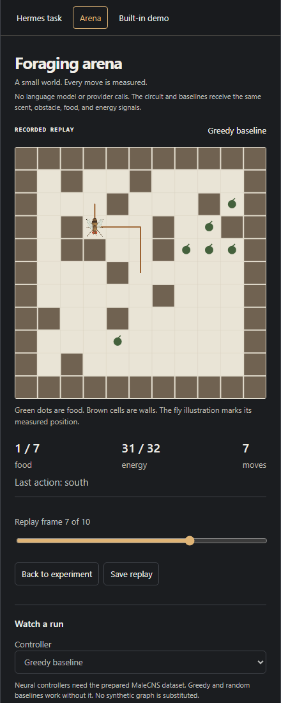

# Foraging arena

The Arena tab runs a small closed-loop experiment without a language model.
The controller selects every action in a seeded world. The environment applies
that action and returns new sensory measurements. No repository tools, provider
calls, credentials, or model-generated proposals participate.



The screenshot is a baseline replay. Neural runs are labeled by their controller
and prepared dataset; replayed actions never execute again.

## Watch a run

Start the companion, open Flymes, and select **Arena**. Choose a controller,
world seed, and move limit, then select **Run arena**. Pause holds the current
position; resume continues the same episode. Stop preserves an incomplete result.
Leaving the Arena tab requests a stop. A disconnected panel stops the experiment
after its 30-second control lease expires.

Greedy and random baselines work without a dataset. Neural controllers require
the prepared MaleCNS graph configured with the companion's `--dataset` option.
A missing or invalid dataset never falls back to a synthetic graph. A development
subset retains its dataset label. The animated specimen is an illustration of
the measured position, not a simulation of fly anatomy or movement.

An older checkout may already have a prepared graph in `data/malecns-v1/prepared-full`.
Either follow the [storage migration instructions](setup.md) or launch the
companion from the checkout with an explicit path:

```powershell
.venv\Scripts\python.exe -m flymes.cli serve --dataset data/malecns-v1/prepared-full
```

Use the same `HERMES_HOME` as the gateway. Run only one companion on its port.

## Experimental protocol

Each map is an 11 by 11 grid with connected walkable cells, fixed obstacles,
and seven food sites. The world seed fixes all positions. Every episode starts
in the center with 32 energy. An action costs one energy; eating restores 12,
up to a maximum of 32. Food cannot be eaten twice. An episode ends when it
collects all seven sites, exhausts energy, reaches the move limit, or is stopped.

The available actions are north, east, south, west, eat, and wait. Every policy
receives the same four directional scent values, four neighboring obstacle flags,
food-underfoot flag, and normalized energy. Scent is the maximum inverse Manhattan
distance to remaining food, sampled at each neighboring cell. It crosses walls.
No policy receives the full map or a route to food. A shared action mask prevents
walking into a wall or eating where there is no food. The greedy policy may get
trapped by obstacles; it is a local rule, not an optimal planning baseline.

| Controller | Decision rule |
| --- | --- |
| Connectome | Existing rate dynamics on the prepared graph, with the arena's sensory encoder |
| Rewired | Same input and output mappings, with shuffled source stubs preserving in/out edge multiplicity degrees and row weights |
| No recurrence | External drive remains; recurrent input is removed |
| Lesioned | Seeded neuron silencing, at the chosen percentage |
| Greedy baseline | Eat when possible; otherwise take an unblocked move with the strongest scent |
| Random baseline | Uniformly sample the shared valid-action list |

The arena assigns ten input channels to neurons using a fixed seeded mapping.
It reads mean activity from six seeded output pools. Each decision advances four
5 ms simulation ticks with the same rate equation as [the coding controller](modeling.md).
These input and output assignments are engineered, have no anatomical support,
and are not trained. The arena is a test of this specified controller, not a claim
that a fly understands the grid or that its brain has been faithfully emulated.

## Compare controllers

Select at least two controllers and a count of consecutive world seeds. The
comparison resets world and neural state before every episode. All conditions
share a fixed circuit seed and input/output mappings. **Food collected out of
seven** is the primary measure. The table reports mean food and the number of
completed episodes. Energy exhaustion and the move limit are valid outcomes;
stopped episodes are incomplete and excluded from averages.

The report contains every result, world hashes, seeds, limits, graph fingerprint,
source hashes, and protocol details. Wall time includes playback pacing for
single runs; it is not a fair speed comparison against unpaced batch runs.
The UI bounds batches to ten worlds, six controllers, and 120 actions per episode.
Neural comparisons on the full graph can take several minutes.

This is an exploratory pilot protocol. It does not establish a wiring advantage,
biological behavior, learning, or generalization. More world seeds alone do not
test sensitivity to the input/output mapping. The CLI exposes `--seed` for worlds
and `--circuit-seed` for independent mapping experiments.
Use distinct training and evaluation tasks before adding a learned decoder.

To reproduce a comparison without Desktop:

```powershell
.venv\Scripts\python.exe -m flymes.cli arena --dataset data/malecns-v1/prepared-full --seed 7 --seeds 3 --steps 40
```

For a data-free baseline comparison:

```powershell
.venv\Scripts\python.exe -m flymes.cli arena --arena-modes GREEDY RANDOM --seed 7 --seeds 3 --steps 40
```

The CLI owns its run and maintains its own lease. Interrupt it to stop.

## Replay and export

After an episode finishes, expand **Individual episodes and replay** and choose
**Replay**. The slider scrubs measured positions and action readouts. The view
stays labeled RECORDED REPLAY and never executes a replayed action.

**Save replay** exports the displayed episode; **Open replay** loads it without
a running companion. **Save report** exports the current experiment's results.
Compact replays omit per-step sensory vectors to fit the Desktop transport.
Full evidence remains under `$FLYMES_STATE_DIR/.flymes/arena/<run-id>/`, with
one JSON file per episode and a `report.json`. Nothing overwrites older runs.
Import accepts only the bounded versioned arena format and files under 1 MB.

The [first full-graph pilot](arena-results.md) includes measured outcomes and a
downloadable replay. All failed episodes are retained in its report.

Arena runs cannot begin while native Fly Mode is enabled or the built-in demo is
running. Return control to Hermes and stop the demo first. The arena does not
register an Agent tool or replace Hermes's provider.
