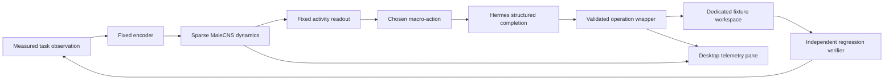

# Architecture

Flymes keeps sparse neural work in a Python companion. The native Desktop pane
polls a Hermes plugin backend proxy. Hermes authenticates that namespace; the
proxy authenticates to a loopback-only companion with a random local token.
The renderer never receives that token. Browser origins cannot call the
companion directly. Provider credentials stay in Hermes.

The model can choose a permitted operation inside the selected action. It
cannot choose the next macro-action. TEST and FINISH execute a fixed verifier
without a model request. FINISH can fail. A budget stop is a safety event.

Each run owns a fresh copy of the fixture, adapter, simulator and event log.
Only one action runs at a time. Each decision records its preceding checkpoint,
observation, encoder output, activity readout, scores and validity mask before
dispatch. Results and the next observation follow in the append-only log.
Run IDs and step IDs bind retries to their original action. The service pauses
or stops on a lost control lease. The CLI uses an explicit longer lease because
it owns its complete run rather than a disappearing renderer.

The simulator advances 20 ticks per decision and freezes while Hermes works.
Wall time includes provider delays; simulation time does not. Checkpoints store
neural state, lesions, seed, tick count and graph fingerprint. Replay readouts
restore a checkpoint and feed the same observation through each mode without
executing work. They restore the live state afterward. This is open-loop
sensitivity, not closed-loop task performance.

HTTP telemetry carries the current 320-neuron sample, the latest eight compact
action results and numeric comparison readouts. Full operation arguments, prior
neural samples and checkpoints stay in the on-disk run record. A recorded
18-result state with all five controls serializes to about 34 KB through this
interface. The earlier 169 KB response stalled at roughly 65 KB on this Windows
transport. Compact responses avoid that reproduced failure without discarding
experiment evidence. Tests enforce the size bound and read the complete response
over an actual loopback socket.

The action boundary deliberately supports one pure Python filtering function.
That restriction makes the demonstration inspectable on Windows without an
OS sandbox. Arbitrary repository tasks are not supported by this release.
